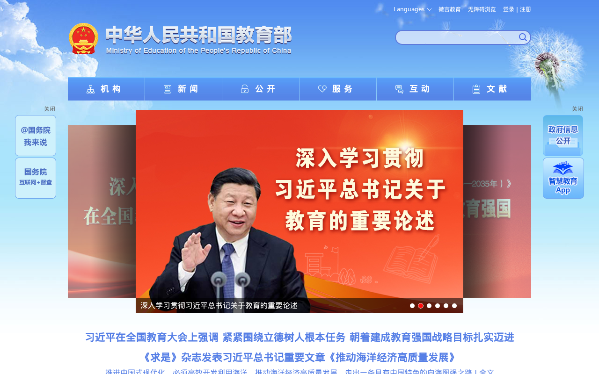
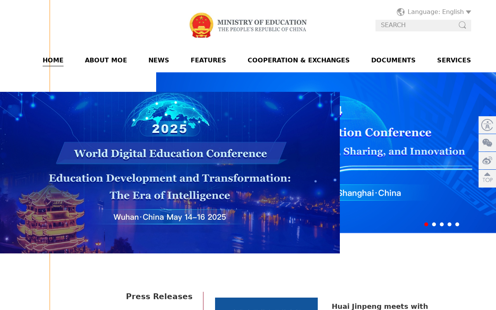

# Tarea: Instituciones gubernamentales chinas

**Alumno:** Hesus

---

## 1. Tema de investigación

Política de educación en inteligencia artificial en China: cómo el gobierno regula y promueve la enseñanza de IA en todos los niveles educativos.

---

## 2. Institución gubernamental más relevante

**Ministerio de Educación (教育部)**
Ministry of Education of the People's Republic of China

- Sitio web: https://www.moe.gov.cn/
- Versión en inglés: http://en.moe.gov.cn/

Otras instituciones relevantes:
- Ministerio de Ciencia y Tecnología (科学技术部) — https://www.most.gov.cn/
- Administración del Ciberespacio de China (国家互联网信息办公室) — https://www.cac.gov.cn/

---

## 3. Captura de pantalla del sitio web

---

## 4. Párrafo (80-100 palabras)

### En español

El Ministerio de Educación es la institución más importante de China para la política de educación en inteligencia artificial. Controla directamente los currículos en todos los niveles — primaria, secundaria y educación superior — y ha emitido todas las directivas importantes sobre educación en IA desde 2018. Su Plan de Acción para la Innovación en IA obligó a las universidades a crear programas interdisciplinarios "IA+X", mientras que su guía de noviembre de 2024 integró la educación en IA en todos los grados de K-12. Designó 184 escuelas piloto como bases de educación en IA y lanzó la plataforma Smart Education of China 2.0. Desde septiembre de 2025, todas las escuelas deben ofrecer al menos 8 horas anuales de instrucción en IA.

### In English

The Ministry of Education is China's most important institution for AI education policy. It directly controls curricula at every level — primary, secondary, and higher education — and has issued every major AI education directive since 2018. The MOE's AI Innovation Action Plan mandated "AI+X" interdisciplinary programs at universities, while its November 2024 guidance integrated AI education into all K-12 grade levels. It designated 184 pilot schools as AI education bases and launched the Smart Education of China 2.0 platform. Since September 2025, all schools must offer at least 8 hours of AI instruction annually, making the MOE the central architect of China's AI talent pipeline.

*Word count: 100*
